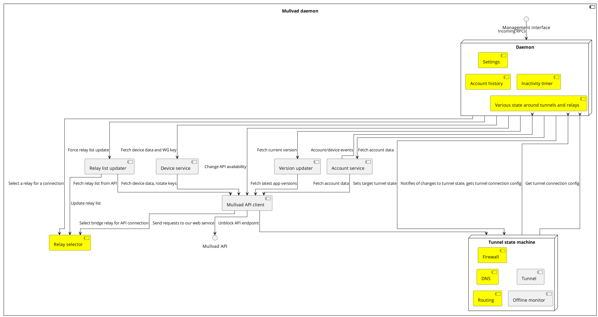
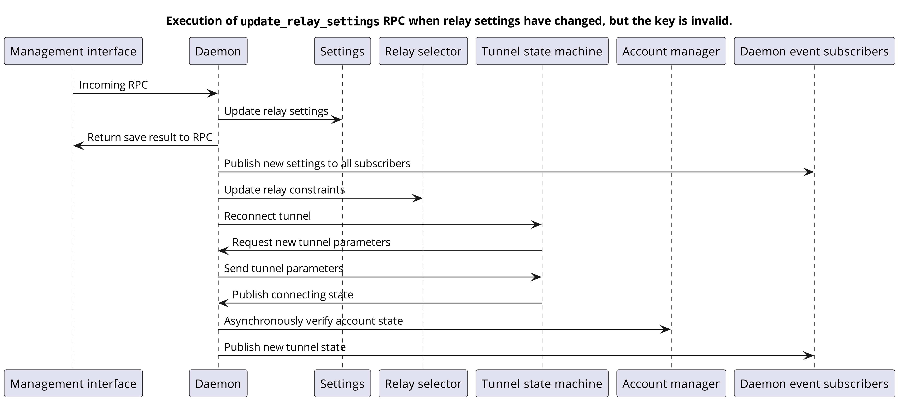

# Mullvad VPN app architecture

This document describes the code architecture and how everything fits together.

For security and anonymity properties, please see [security](security.md).

Some components have specific documentation that go into greater detail:

- [winfw](../windows/winfw/README.md)

## Mullvad vs talpid

Explain the differences between these layers and why the distinction exists.
My thought was that after this section every aspect of the app is explained
under either the Mullvad or the Talpid header. So it's clear which part they
belong to. I yet don't know if this makes sense though.

## The daemon
The client consists of two main parts - the daemon and the GUI, but there's also a CLI. The daemon
is the process that's responsible for upholding the security guarantees of the client, it consists
of an actor system so that it can drive many processes asynchronously, allowing for a multiplicity
of clients.

The daemon receives commands from the [front-ends](#frontends) (GUI and CLI) via the management
interface and these are serviced asynchronously via the daemon, often interacting via various other
components during and after the RPC has been finished. There are various dependencies between the
different components and it's important to ensure no deadlocks occur, and some executions flows that
provide essential behavior can be hard to trace.

## Mullvad part of daemon

### Frontend <-> system service communication
This is done via GRPC ([here's](../mullvad-management-interface/proto/management_interface.proto)
the relevant proto file) over a Unix domain socket on desktop platforms and via a JNI on Android. In
both cases, the frontends end up sending a message to the daemon that it then services. The
servicing of any message must never block any other message. Frontends can also subscribe to
messages from the daemon, to receive updates about the tunnel state, new settings, new relay lists,
version information and device events.

### Talking to api.mullvad.net.
Reaching the API is done via a direct TLS connection to the API host or via a shadowsocks bridge, to
increase censorship resistance. There are multiple components that interact with the API in an
asynchronous fashion, so to manage them all, there's an actor that specifically deals with sending
REST requests to the API.

The API must be reachable in secured states even if a tunnel is not up, so the API runtime interacts
with the [tunnel state machine](#tunnel-state-machine) to send over the currently used API endpoint.
This can be a source of deadlocks, so no actor should ever be blocked by an API request if the TSM
relies on it to change states.

All API requests can be dropped in flight to allow for resetting the connection whenever a tunnel is
established. The API requests can also be blocked when in the offline state or when it's assumed
that the user hasn't used our client for a period of time.

### Selecting relay and bridge servers
See [this document](relay-selector.md).

### Problem reports

## Talpid part of daemon

### Tunnel state machine

The tunnel state machine is the part of Talpid that coordinates the events for establishing a VPN
connection. It acts upon requests for establishing a secure VPN connection or for disconnecting an
already established connection and returning the system to its initial state. This involves also
using other parts of Talpid to configure the system so that the security policies are applied and
so that the connection works correctly without any further manual configuration necessary.

The tunnel state machine starts in an initial `Disconnected` state. In this state, no changes are
made to the operating system and no security policies are applied. When a request is sent to the
state machine to establish a connection, the state machine will progress first into a `Connecting`
state that will configure the operating system and setup a tunnel with a connection to a VPN server.
Once the configuration is complete and the connection is verified to be working, the state machine
then proceeds to a `Connected` state.

A request can be made to close the VPN connection. Such request will lead the state machine into
a `Disconnecting` state, which will close the connection to the VPN server and restore the operating
system to its original configuration. After the process is complete, the state machine returns to
the `Disconnected` state.

If an error occurs in the `Connecting` or `Connected` states, the state machine may proceed to an
`Error` state. It might reach this state either immediately (when an error occurs in the
`Connecting` state) or after passing through another state to tear down the tunnel (when an error
occurs in the `Connected` state). Either way, in this state the operating system is configured to
block all connections to avoid leaking any data. The objective is to ensure no data leaks from the
tunnel while the user has requested a secure connection, as defined in the [security document].

A high-level overview of the tunnel state machine can be seen in the diagram below:

                    +--------------+   Request to connect    +------------+
      Start ------->| Disconnected +------------------------>| Connecting |
                    +--------------+                         +----+--+--+-+
                        ^                                      ^  |  ^  |
                        |           Will attempt to reconnect  |  |  |  |
                        |   .----------------------------------'  |  |  |
                        |   |                                     |  |  |
                        |   |                   .-----------------'  |  |
                        |   |                   | Unrecoverable      |  |
                        |   |                   |     error          |  |
                        |   |    Request to     V                    |  |
     System is restored |   |    disconnect +-------+                |  | Connection is configured
       to its initial   |   |   .-----------+ Error +----------------'  |       and working
        configuration   |   |   |           +-------+  Request to       |
                        |   |   |               ^       connect         |
                        |   |   |               |                       |
                        |   |   |  .------------'                       |
                        |   |   |  | Unrecoverable                      |
                        |   |   |  |  error while                       |
                        |   |   |  |  in connected                      |
                        |   |   V  |     state                          V
                     +--+---+------+-+                         +-----------+
                     | Disconnecting |<------------------------+ Connected |
                     +---------------+  Request to disconnect  +-----------+
                                          or unrecoverable
                                               error

[security document]: security.md

#### State machine inputs

There are two types of inputs that the tunnel state machine react to. The first one is commands sent
to the state machine, and the second is external events that the state machine listens to. Reacting
to any event can result in the state machine transitioning away to a different state.

##### Tunnel commands

Besides the two main commands `Connect` and `Disconnect`, there are a few other commands that can be
sent to the tunnel state machine. The following list includes all the commands the tunnel state
machine can receive.

- *Connect*: establish a secure VPN connection
- *Disconnect*: tear down the active VPN connection and return the operating system to its initial
  configuration
- *Allow LAN*: enable or disable local network sharing, changing the security policies for some of
  the states
- *Block when disconnected*: configures whether the state machine should apply the security policy
  for blocking all connections when it's in the `Disconnected` state, effectively requesting the
  system to never allow connections outside the tunnel

##### External events

Depending on the state of the machine, it will also listen for specific external events and act
on them possibly by changing states. All of these events can be considered as tunnel events, but
they happen on different scenarios and because of different causes.

- *Tunnel is Up*: the tunnel monitor notifies that the tunnel is working correctly
- *Tunnel is Down*: the tunnel monitor notifies that the tunnel has disconnected
- *Tunnel monitor stopped*: communication to the tunnel monitor was lost
- *Is offline*: notify the tunnel state machine if the operating system is connected or not to the
  network, so that it can safely wait for connectivity to be restored without endlessly retrying to
  establish the VPN connection. Some care needs to be taken to not get stuck in the offline state
  for too long on [macOS](allow-macos-network-check.md).

#### State machine outputs

Every time the state machine changes state, it will output a `TunnelStateTransition`. This is an
`enum` type representing which state the tunnel state machine has entered and any associated
metadata that might be useful.

- *Disconnected*
- *Connecting*: includes the information of the endpoint it is trying to connect to
- *Connected*: includes the information of the endpoint it is connected to
- *Disconnecting*: includes the state it will transition to once successfully disconnected, which
  is represented as the action it will take after disconnected, listed below:
  - *Nothing*: proceed to the `Disconnected` state
  - *Block*: proceed to the `Error` state
  - *Reconnect*: proceed to the `Connecting` state
- *Error*: includes the cause of the error and the information if the operating system was
  successfully configured to block all connections

### System DNS management

### Firewall integration

### Detecting device offline

The tunnel state machine has an offline monitor that tries to detect when a device will certainly
not be able to connect to a tunnel or reach the API. In doing so, the offline monitor cannot send
any traffic. In general, this involves either relying on platform APIs specifically designed for
this purpose or querying the system's networking config to enumerate network interface state or the
routing table.

#### Windows

On Windows, connectivity is inferred if there is a default route and the machine is not suspended.
The suspend/wakeup events matter because tunnel device drivers might not work correctly early after
wakeup. As such, the offline mode is used to enforce a grace period.

The conditions are affirmed by doing the following:
- Listening for changes to the default route, primarily via [`NotifyRouteChange2`] - receiving
  callbacks whenever a default route is changed or added via winnet.
- Checking if the machine is suspended by listening for power state broadcasts by creating a window
  and listening for power state messages.

#### Linux

On Linux, connectivity is inferred by checking if there exists a route to a public IP address.
Currently the Mullvad API IP is used, but the actual IP does not matter as long as it's not a local
one. This is done via Netlink and the route is queried via the exclusion firewall mark - otherwise,
when a tunnel is connected, the address would always be routable as it'd be routed through the
tunnel interface. As such, the offline monitor is somewhat coupled to routing and split tunelling on
Linux.

#### macOS

On macOS,  the offline monitor uses `route -n monitor -` to listen for changes in the routing table,
reasserting that a default route exists any time a change is detected. It's only assumed that the
host is offline if a default route doesn't exist.

##### Issues

After coming back from sleep, the network reachability callback won't be invoked until macOS has
done some verification tasks, some of which may depend on DNS. Since our firewall will block DNS,
the tasks will be delayed, and so will the callback. Circumventing the call back is of no use -
until the timeouts are hit, macOS won't publish a default route to the routing table, which is
needed for routing tunnel traffic.

#### Android

To detect connectivity on Android, the app relies on [`ConnectivityManager`] by listening for
changes to the availability  of non-VPN networks that provide internet connectivity.  Connectivity
is inferred if such a network exists.

#### iOS

The iOS app uses WireGuard kit's offline detection, which in turn uses [`NWPathMonitor`] to listen
for changes to the route table and assumes connectivity if a default route exists.

### OpenVPN plugin and communication back to system service

### Split tunneling

See the [split tunneling documentation](split-tunneling.md).

## Frontends

### Desktop Electron app

### Android

### iOS

### CLI

[`NotifyRouteChange2`]: https://docs.microsoft.com/en-us/windows/win32/api/netioapi/nf-netioapi-notifyroutechange2
[`SCNetworkReachability`]: https://developer.apple.com/documentation/systemconfiguration/scnetworkreachability-g7d
[`SCDynamicStore`]: https://developer.apple.com/documentation/systemconfiguration/scdynamicstore-gb2
[`ConnectivityManager`]: https://developer.android.com/reference/android/net/ConnectivityManager
[`NWPathMonitor`]: https://developer.apple.com/documentation/network/nwpathmonitor
