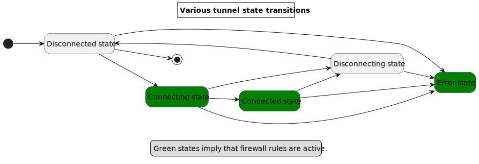
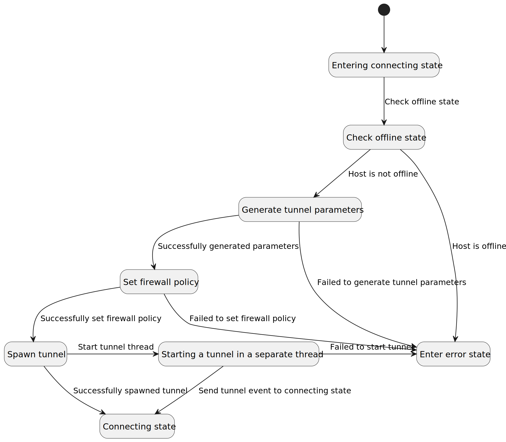
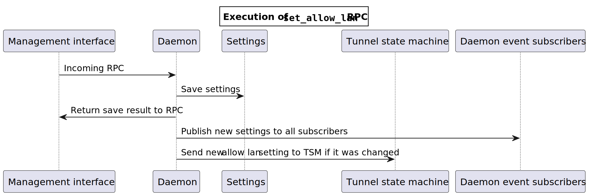
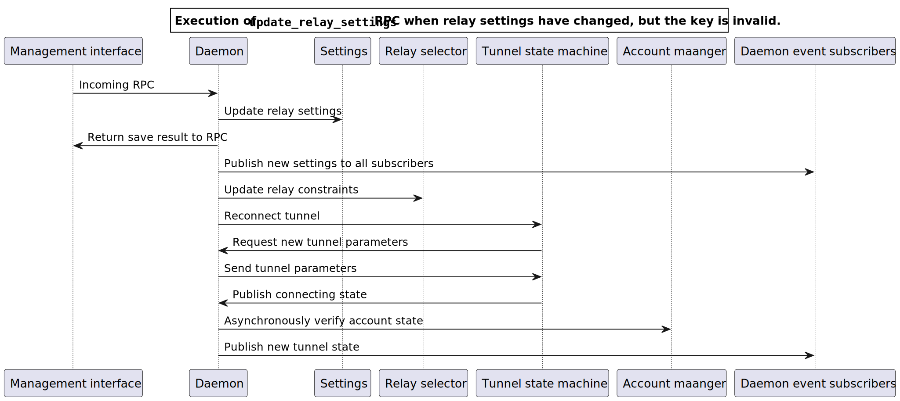

<!-- $theme: default -->

# The tour
- What, why and *how* of the daemon
- Architecture of the daemon

---

# What
The daemon is a system service that creates tunnels.

- Runs as a standalone service on Windows, Linux, macOS and *kind of* Android
- Has a GRPC interface and a custom JNI interface for Android

---

# Why
- Can have multiplicity of clients
- Better separation of concerns
- Need elevated privileges to do VPN things (routing, firewall)

---

[//]: # (Some of these terms are hand-wavy, and will make more sense later)

# Responsibilities
- Manage tunnel state - connected, disconnected, *blocking traffic* when necessary
- Be responsive to all front-ends, all the time
- Once the target state is set to be secured, must ensure there are no leaks
- Interface with our web service (relay list, version information, account validity)
- Manage user settings
- Keep track of account data and keys, the data necessary to connect

---

[//]: # (Handling )
## Concurrency and components

No one client must be able to block the daemon from servicing other clients.

Lots of resources are being managed concurrently, e.g. downloading relay lists and monitoring routes.

---

# The cast

The daemon has an actor system that's rather informal, so it consists of a lot of actors.

Each actor may contain loosely defined components, e.g. the tunnel state machine has a firewall component.

Whenever an RPC is called, an event corresponding to the RPC is sent to a daemon actor, and the daemon then processes the RPC.

[//]: # (An actor is )

---

---
# The supporting cast
There's lots of somewhat disparate components strewn across various crates and modules.

Common data types that would be used in different crates should be defined in either `mullvad-types` or `talpid-types` crates.
These crates should contain as little logic  as possible.

---
## The great divide
Originally, the world was split into two - *talpid* and _mullvad_.

The talpid set of packages were supposed to be generic, and not Mullvad related.

As the codebase has developed, upholding this divide has only become more cumbersome with time.

Generally, one only needs `talpid-core` to have an application that creates safe tunnels safely.

To create a good VPN client that integrates with Mullvad, you'll want `mullvad-daemon`.

---

### Talpid responsibilities
- Create tunnel interfaces
- Route traffic
- Set up firewall rules
- Enable split tunnelling

---

### Mullvad responsibiliites
- Manage talpid layer
- Handle account data
- Handle settings

---

## The daemon
[//]: # (It's a bit messy, there's a crate and a type and it's an actor, and it's the main star of the show)
[//]: # (Sort of like the lyrical protagonist)
The daemon has a whole crate of it's own, `mullvad-daemon`.

It effectively implements the management interface, servicing all RPCs and is the _entry point_ of the process.

It's the most spaghetti component there is.

### Interacts with
- TSM
- REST service
- Account manager
- Version checker
- Relay list updater
- Relay selector

### Owns
- Settings
- Target tunnel state
- Interacts with almost all other actors

Resides in `mullvad-daemon`, in the top-level module.
[//]: # (We love to reuse terms, sometimes)

---

## The tunnel state machine
Manages the firewall, routing and the tunnel, and ensures the security properties of the client. The state machine has 5
distinct states:
- Disconnected
- Disconnecting
- Connecting
- Connected
- Error state

### Interacts with
- Daemon
- REST service

### Owns
- Firewall
- Route manager
- DNS manager
- Tunnel

[//]: # (Route manager is actually an actor itself)
[//]: # (Tour through DNS, )

Resides in `talpid-core::tunnel_state_machine` and is a collection of the various states.

---

## The tunnel state machine
Everything except for the tunnel has a platform specific implementation, sometimes having multiple different implementations on the same platform (DNS on Linux).

Most of the platform specific code is Rust, and often depends on external crates, but Windows and Android are different.

Windows has it's own implementations written in C++, resides in `windows/`.

Android implementations need to call into Java code, more on that later.

---

---

---

## REST service

The bridge between our clients and our API (web service).

It's *special*, using a custom transport trait to do TLS cert pinning and allow connecting through a proxy.

---

It can:
* Send requests to our API
* Select an API endpoint
* Unblock said API endpoint in the firewall
* Drop all existing requests when a connection is reset
* Ensure that the API is reachable even in a blocked state

---

## Interacts with
- Daemon
- TSM
- Account service
- Device service
- Version checker
- Relay selector
- Relay list updater

Resides in it's own crate `mullvad-api`, has lots of `*Service` types to help with interacting specific subsets of the web service endpoints, such as the accounts service.

---

## Account manager/service
- Checks if the account has expired
- After enough disconnects the daemon will make it check if the device is still valid
- Periodically rotates WireGuard key

### Interacts with
- Daemon
- REST service

### Owns
- Device data
- Doesn't own account expiry

A module of the `mullvad-daemon` crate.

---

## Version updater
- Periodically checks if a newer version has been released
- Caches it's results

### Interacts with
- Daemon
- REST service

### Owns
- Cached version information

Resides in `mullvad_daemon::version_check`

---

## Relay list updater
Periodically tries to download a newer version of the relay list.

Can also be forced into updating manually.

### Interacts with
- Daemon
- REST service

---

## Interface to the world

All user facing interactions with the daemon happen through the management interface.

[//]: # (Go look at the management interface proto file)

On Windows, Linux and macOS, it's a GRPC service listening on a unix socket/named pipe. See the `mullvad-management-interface` crate for more saucy details.

On Android, it's a custom JNI interface that generally mimics the GRPC interface.

---

## RPCs

The various RPCs can be loosely grouped into the following groups:
- RPCs used to change target tunnel state
- Client version information
- Control the daemon's state (shutdown, prepare for a restart, factory reset).
- Setting relay constraints (changing settings that select relays)
- Changing settings
- Device management
- WireGuard key management
- Split tunelling (on Windows and Linux)

---

---

---

## Events

The clients can also subscribe to a single stream of daemon events, which contain the following data:
- Changes in tunnel state
- Changes in settings
- Changes in account data

---

# Android

Android's APIs are higher level and exposed through Java, so the JNI environment has to be dragged along to every call site.

The daemon doesn't (can't) handle routing.

There is no firewall per se, the tunnel and implied routes are used to block outgoing traffic.

*For more info check out `mullvad-jni`*

---

## Startup
There are some interesting inter-dependencies before all of the components are set up.

