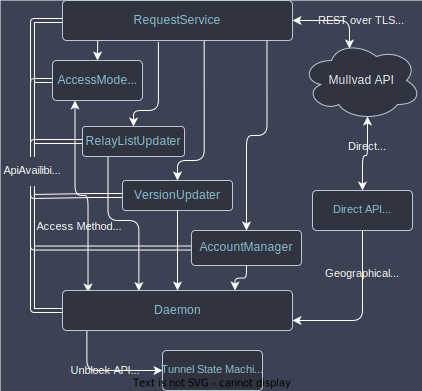

<!-- headingDivider: 3 -->
<style>
/* Reduce the text size, if necessary */
section {
  /* font-size: 25px; */
}
/* Footnotes using custom blockquotes */
blockquote {
    border-top: 0.1em dashed #555;
    font-size: 60%;
    margin-top: auto;
}
</style>

<!-- README: This a presentation about the architecture of the Mullvad VPN daemon, held in February of 2025. The presentation is generated from this document using [Marp](https://github.com/marp-team/marp/) and the flowcharts using <https://app.diagrams.net/> (the images can be opened and modified directly, as the source code is embedded in the `.drawio.svg` format). Slides are separated either by headings, or `---`, and comments at the bottom the slide are converted to speaker notes when exporting the presentation. -->

# Mullvad VPN daemon tour 2025 😈

Outline:

- [What is the daemon?](#what-is-the-daemon)
- [The actor model](#the-actor-model)
- [Tunnel State Machine](#tunnel-state-machine)
- [Mullvad API client](#mullvad-api-client)
- [Workspace layout](#workspace-layout)
- [Testing the daemon](#testing-the-daemon)

# What is the daemon?
<!-- header: Basics -->
- A system service that sets up wireguard tunnels to the Mullvad VPN relays.
- It's used by all the desktop platforms and on Android, which have separate front-ends that interface with the daemon using gRPC.
- This server-client architecture provides for better separation of concerns and allows only the daemon to have elevated privileges while the GUI can run as an unprivileged process.

## Example of a connection

The basic recipe for a Mullvad WireGuard tunnel is:

1. Fetch relay list and exchange wireguard keys with the Mullvad API servers
2. Set up and configure a tunnel with  `wireguard-go`
3. Set up routes, firewall and DNS to secure the connection from leaks


## The Actor Model

To prevent blocking, the app is split into multiple asynchronous actors that communicate using (mostly) message passing:

- Daemon - The main process
- gRPC server
- `RequestService` - REST client
- Tunnel State Machine


## Tunnel State Machine

The Tunnel State Machine (TSM) lives in `talpid-core` and manages the tunnel, firewall, routing, and DNS. The five states each represent a set of guarantees about the security of the user's connection:

- ❌ **Disconnected state**: No changes are made to the operating system and no security policies are applied, unless "lockdown mode" is enabled.
- 🔄 **Connecting state**: Tunnel is started. Host is online, firewall blocks all traffic except to and from relay*. 🔒
- ✅ **Connected state**: Same as for connecting, but tunnel is up and verified to be functioning and firewall allows traffic on the tunnel interface*. 🔒
- 🔌 **Disconnecting state**: No guarantees, inherits the properties of the previous state. Lasts until the tunnel is shut down.
- 🚫 **Error/Blocked state**: Firewall blocks all traffic*. 🔒

> **Exceptions apply to ARP, DHCP, NDP, loopback adapters, and local networks*
<!--
Notes:
When lockdown mode is enabled, the disconnected state "acts" as a the blocked state, but technically is still a separate state.
The error state may fail to apply it's firewall rules, in which case it will not be secure.
-->
---

<!-- header: "**Tunnel State Machine**" -->
```text
               ┌──────────────┐   Request to connect    ┌────────────┐
 Start ───────►│ Disconnected ├────────────────────────►│ Connecting │
               └──────────────┘                         └────┬─────┬─┘
                   ▲                                      ▲  │  ▲  │
                   │           Will attempt to reconnect  │  │  │  │
                   │   ┌──────────────────────────────────┘  │  │  │
                   │   │                                     │  │  │
                   │   │                   ┌─────────────────┘  │  │
                   │   │                   │ Unrecoverable      │  │
                   │   │                   │     error          │  │
                   │   │    Request to     ▼                    │  │
System is restored │   │    disconnect ┌───────┐                │  │ Connection is configured
  to its initial   │   │   ┌───────────┤ Error ├────────────────┘  │       and working
   configuration   │   │   │           └───────┘  Request to       │
                   │   │   │               ▲       connect         │
                   │   │   │               │                       │
                   │   │   │  ┌────────────┘                       │
                   │   │   │  │ Unrecoverable                      │
                   │   │   │  │  error while                       │
                   │   │   │  │  in connected                      │
                   │   │   ▼  │     state                          ▼
               ┌───┴───┴──────┴┐                         ┌───────────┐
               │ Disconnecting │◄────────────────────────┤ Connected │
               └───────────────┘  Request to disconnect, └───────────┘
                                reconnect or unrecoverable
                                         error
```

> The ASCII-flowchart is taken from the [architecture document](architecture.md).
<!--
Notes:
The guarantees that each state represents are set before the given state is entered, so there is a brief period at the end of each state where its guarantees are not upheld.
The disconnecting state also handles reconnection.
-->

## Tunnel State Machine interactions

<style scoped>
section {
    font-size: 24px;
}
</style>

The state can change in response to commands from the `Daemon` (e.g. "connect") or events from `WireguardMonitor` (e.g. "Tunnel up/down").

The tunnel device and wireguard configuration is created by the `WireguardMonitor` using a platform-specific `TunProvider` and `TunnelParameters`, which are fed to WireGuard.

<!--
Notes:
`TunnelEvent`s include AuthFailed, InterfaceUp, Up and Down.
`TunnelCommand`s include Connect, Disconnect, Connectivity, AllowLan, etc.
The WireGuard monitor lives for the duration of the tunnel/connection, and is recreated whenever the connecting state is entered
  -->
<!-- TODO: The connectivity manager on android notifies the routing manager about new routes, so there is an arrow missing -->


### Offline Monitor

The offline monitor tries to, without sending any traffic, detect when a device can't connect to a tunnel or reach the API. In general, this involves either relying on platform APIs specifically or the system's network interface state or the routing table. Each platform uses the following condition:

- Android: If there exists a non-VPN network that provides internet connectivity, as detected by `ConnectivityListener`.
- Linux: If there exists a route to a public IP address.
- Windows: If there exists a default route and the machine is not suspended.
- macOS: If there exists a default route. This condition is checked every time the routing table is updated.

### Mullvad API client
<!-- header: Mullvad API client -->
Reaching the API is done via a direct TLS connection to the API host. If the host IPs are censored, we can access the API via an alternative access mode:

- Shadowsocks proxies via Mullvad Bridges
- Encrypted DNS proxy, which receives a hidden server IP from a DoH request.
- Custom SOCKS5 proxy

The API must be reachable in secured states even if a tunnel is not up, so the API runtime interacts with the tunnel state machine to unblock the currently used API endpoint from the firewall.

All API requests can be dropped in flight to allow for resetting the connection whenever a tunnel is established. The API requests can also be blocked when offline or when the app is disconnected and idle for a long time.

<!-- The daemon uses a `RequestServiceHandle` to pass messages to a `RequestService`. The `RequestService` has a handle to an `AccessModeSelector` -->

### Mullvad API client interactions

<style scoped>
section {
    font-size: 27px;
}
</style>

A single request service that uses the selected access mode is spawned for all API communication, except for Geographical IP location ([am.i.mullvad.net](https://am.i.mullvad.net/)), which always uses the direct mode.

Requests have automatic retries, and are cancelled in-flight when the tunnel state or access mode changes.



<!-- TODO: Add a slide about API access methods. Is the framework easily extendable? -->
<!-- TODO: Add a slide about <https://am.i.mullvad.net/>? -->

## Workspace layout
<!-- header: Workspace layout -->
The daemon is a Rust workspace with many member crates, divided into the `mullvad` and `talpid` families. The `mullvad` crates contain higher level code specific to Mullvad, while the `talpid` crates provide lower level functionality that could be used by any VPN implementation.

## Workspace layout - Rust

A Rust workspace allows multiple related packages (crates) to be developed together. The project's root `Cargo.toml` defines which crates are part of the workspace, while each crate has its own `Cargo.toml` that defines its specific dependencies and build configuration. This structure helps manage the complexity of the daemon by separating concerns into discrete, maintainable units. All compiled artifacts are placed in a shared `target` directory, which helps avoid duplicate compilation of shared dependencies.

## Workspace layout - Mullvad crates

- `mullvad-daemon`: The main Rust crate that builds the daemon binary; a system service that manages the VPN client.
- `mullvad-relay-selector`: Manages the selection of VPN relay servers based on user preferences and network conditions.
- [`mullvad-api`](#mullvad-api-client): Handles interactions with the Mullvad API, including account management and server list updates.
- `mullvad-encrypted-dns-proxy`: A port forwarding proxy that retrieves its configuration from a AAAA record over DoH

## Workspace layout - Mullvad crates

- `mullvad-management-interface`: Exposes a gRPC API to the daemon.
  - `gRPC`: Remote procedure calls framework initially created by Google.
  - `protobuf`: Protocol Buffers are used for serializing structured data.
- `mullvad-jni`: Provides Java Native Interface (JNI) bindings for the Mullvad daemon, enabling integration with Android.
  - `jnix`: A submodule within `mullvad-jni` that facilitates JNI operations.
- `mullvad-types`/`talpid-types`: Defines common types. These crates do not depend on any other crates in the workspace, which helps avoid cyclic dependencies.

## Workspace layout - Talpid crates

- [`talpid-core`](#tunnel-state-machine): The core library for the VPN client. Owns the tunnel state machine and manages the firewall and DNS.
- `talpid-tunnel`: Manages tunnel devices
- `talpid-routing`: Manage routing tables on various platforms
- `talpid-wireguard`: Provides support for different WireGuard VPN tunnels.
  - `WireGuardNt`: WireGuard implementation for Windows.
  - `WireGuard in Linux kernel`: WireGuard implementation integrated into the Linux kernel.
  - `wireguard-go`: A Go implementation of WireGuard for cross-platform support.

## Workspace layout - Talpid crates

- `wireguard-go-rs`: Rust bindings for the WireGuard Go implementation, enabling its use within the Rust ecosystem.
- `talpid-tunnel-config-client`: Sets up PQ safe and DAITA enabled tunnels using ephemeral peers
- `tunnel-obfuscation`: Provides different types of obfuscation layers for WireGuard

## Testing the Daemon
<!-- header: Testing the Daemon -->
The daemon, being a rust project, has built in support for unit tests using `cargo test`. These are used to test internal components, which may not be public the rest of the codebase.

We also have a more extensive end to end test framework, which resides in the [test](../test) folder.

<!-- The structure consists of the `test-manager`, which spawns a `test-runner` inside a VM of the platform to be tested. The `test-manager` communicates with the `test-runner` using `test-rpc`, and instructs it to install a specific version of the app and run tests on it using either the desktop GUI or the CLI. The end to end tests can be run as [github actions](https://github.com/mullvad/mullvadvpn-app/actions/workflows/desktop-e2e.yml), which is done for each platform on the main branch once every night. -->

# Done - Thanks for coming! 🎉
<!-- header: "**Appendix**" -->
**Questions?**

<!-- markdownlint-disable-file MD013 MD024 MD033 MD041 MD036 MD026 -->
