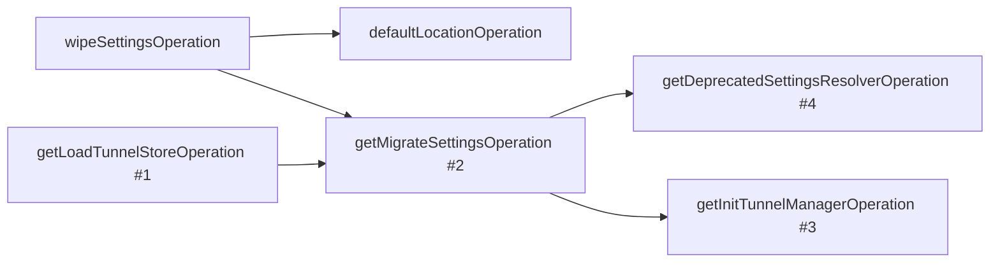
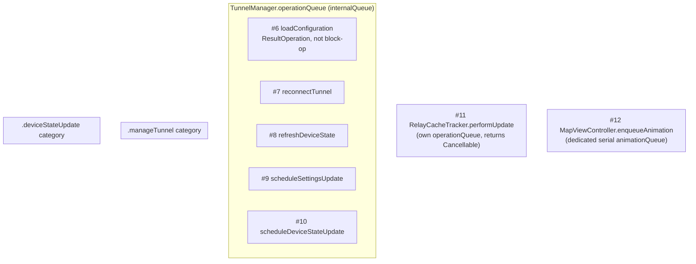

# AsyncOperation → Swift Concurrency: low-effort, low-risk tasks

These are the `AsyncBlockOperation`/`ResultBlockOperation` call sites that can be converted to
`async`/`await` on their own, with no dependency on redesigning `MutuallyExclusive` exclusivity
on `operationQueue`. Everything else (TunnelManager's `reconnectTunnel`, `refreshDeviceState`,
`scheduleSettingsUpdate`, `scheduleDeviceStateUpdate`; `RelayCacheTracker.performUpdate`;
`MapViewController.enqueueAnimation`) is out of scope here — those rely on shared-queue
exclusivity or a cancellation-handle API and need a separate design pass.

---

## Full inventory

Every production (non-test) use of `AsyncBlockOperation` or `ResultBlockOperation` in `ios/`,
confirmed via `grep -rn "AsyncBlockOperation(\|ResultBlockOperation" --include="*.swift"` and
excluding the `Operations/` framework files that *define* them and `OperationsTests/`. 11 total.

| # | Class/function | File:line | Queue | Exclusivity condition | In this doc's scope |
|---|---|---|---|---|---|
| 1 | `AppDelegate.getLoadTunnelStoreOperation` | `AppDelegate.swift:551` | `operationQueue` (main) | — (DAG dependency only) | Task 1 |
| 2 | `AppDelegate.getMigrateSettingsOperation` | `AppDelegate.swift:567` | `operationQueue` (main) | — (DAG dependency only) | Task 1 |
| 3 | `AppDelegate.getInitTunnelManagerOperation` | `AppDelegate.swift:612` | `operationQueue` (main) | — (DAG dependency only) | Task 1 |
| 4 | `AppDelegate.getDeprecatedSettingsResolverOperation` | `AppDelegate.swift:712` | `operationQueue` (main) | — (DAG dependency only) | Task 1 |
| 5 | `AppDelegate.userNotificationCenter(_:didReceive:)` | `AppDelegate.swift:785` | `operationQueue` (main) | none | Task 2 |
| 6 | `TunnelManager.loadConfiguration` (via `LoadTunnelConfigurationOperation`, a `ResultOperation`, not `*BlockOperation` — included for continuity) | `TunnelManager.swift:222` | `operationQueue` (`internalQueue`) | `MutuallyExclusive(.manageTunnel)` | Task 3 |
| 7 | `TunnelManager.reconnectTunnel` | `TunnelManager.swift:297` | `operationQueue` (`internalQueue`) | `MutuallyExclusive(.manageTunnel)` | out of scope |
| 8 | `TunnelManager.refreshDeviceState` | `TunnelManager.swift:925` | `operationQueue` (`internalQueue`) | `MutuallyExclusive(.deviceStateUpdate)` | out of scope |
| 9 | `TunnelManager.scheduleSettingsUpdate` | `TunnelManager.swift:1116` | `operationQueue` (`internalQueue`) | none seen — verify | out of scope |
| 10 | `TunnelManager.scheduleDeviceStateUpdate` | `TunnelManager.swift:1164` | `operationQueue` (`internalQueue`) | `MutuallyExclusive(.deviceStateUpdate)` | out of scope |
| 11 | `RelayCacheTracker.performUpdate` | `RelayCacheTracker.swift:237` | `operationQueue` | none — returns operation as `Cancellable` | out of scope |
| 12 | `MapViewController.enqueueAnimation` | `MapViewController.swift:241` | dedicated `animationQueue` | none — serial queue + `cancelAllOperations()` | out of scope |

(Row 6, `LoadTunnelConfigurationOperation`, isn't an `AsyncBlockOperation`/`ResultBlockOperation`
— it's a hand-written `ResultOperation` subclass — but it's the operation Task 3 targets, so
it's listed for completeness.)

---

## Diagrams

### AppDelegate startup chain (Task 1 target)

The only real dependency graph in this inventory — everything else in the table is a standalone
call with no `addDependency` on another operation.



Numbers refer to the inventory table above. `#5` (notification handler) has no edges — it's
triggered by the system, independent of this launch sequence.

### Queue / exclusivity grouping (everything else)



`#9 scheduleSettingsUpdate` has no confirmed `MutuallyExclusive` condition in the current
source — flagged in the inventory table as needing verification before Task 7 (in the broader
migration list) starts.

---

## Task 1 — Convert AppDelegate startup chain to async/await

**Files:** `MullvadVPN/AppDelegate.swift`

`getLoadTunnelStoreOperation`, `getMigrateSettingsOperation`, `getInitTunnelManagerOperation`,
`getDeprecatedSettingsResolverOperation` are `AsyncBlockOperation`s wired together only with
`addDependency`/`addDependencies` on `operationQueue.addOperations(...)` — no
`MutuallyExclusive` condition involved, just a plain DAG:

```
wipeSettingsOperation ─┬─> defaultLocationOperation
                        └─> migrateSettingsOperation ─┬─> deprecatedSettingsResolverOperation
loadTunnelStoreOperation ─┘                            └─> initTunnelManagerOperation
```

**Approach:** rewrite each `getXOperation()` as an `async throws -> Void` function; replace the
dependency graph with sequential `await` / `async let` in place of `addDependency`.

**Risk:** low. Watch for the existing `MainActor.assumeIsolated` calls inside these blocks —
once the surrounding function is properly `@MainActor`, those become unnecessary and should be
dropped rather than kept.

**Acceptance criteria:** app launch sequence produces identical ordering/behavior; no more
`operationQueue.addOperations` call for this chain.

---

## Task 2 — Convert notification response handler to `Task`

**Files:** `MullvadVPN/AppDelegate.swift:785`

`userNotificationCenter(_:didReceive:withCompletionHandler:)` wraps a single fire-and-forget
block in `AsyncBlockOperation(dispatchQueue: .main)` purely to hop onto `operationQueue`.

**Approach:**

```swift
Task { @MainActor in
    NotificationManager.shared.handleSystemNotificationResponse(response)
    completionHandler()
}
```

**Risk:** low — no dependency graph, no exclusivity condition.

**Acceptance criteria:** notification responses still processed on the main actor before
`completionHandler()` fires.

---

## Task 3 — Async wrapper for `TunnelManager.loadConfiguration`

**Files:** `MullvadVPN/TunnelManager/TunnelManager.swift`, `MullvadVPN/AppDelegate.swift`

Follow the existing `setAccount`/`setNewAccount` pattern (`TunnelManager.swift:436-442`): keep
`LoadTunnelConfigurationOperation` and its `MutuallyExclusive(.manageTunnel)` condition as-is,
make `loadConfiguration(completionHandler:)` `private`, and add:

```swift
func loadConfiguration() async {
    await withCheckedContinuation { continuation in
        loadConfiguration { continuation.resume() }
    }
}
```

Update the call site in `getInitTunnelManagerOperation` (or its Task 1 replacement) to
`await tunnelManager.loadConfiguration()`.

**Risk:** low — the continuation wrapper preserves the exclusivity guarantee against other
tunnel-management operations still on `operationQueue`; nothing about the underlying operation
changes.

**Acceptance criteria:** no public completion-handler `loadConfiguration` left; call site uses
`await`.
